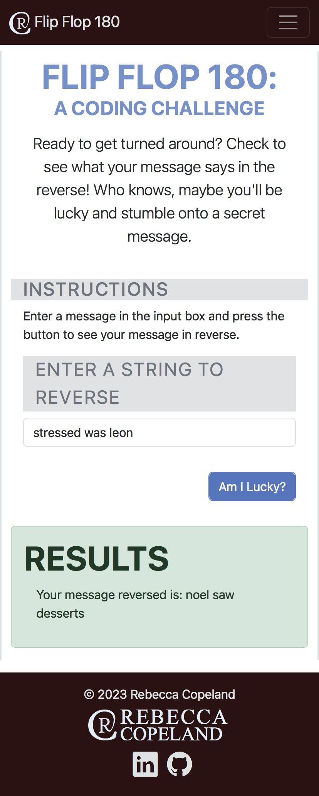

# FlipFlop180 - A Coding Challenge

Ready to get turned around? Check to see what your message says in the reverse! Who knows, maybe you'll be lucky and stumble onto a secret message.

## Table of contents

- [Overview](#overview)
  - [Screenshot](#screenshot)
  - [Links](#links)
- [My process](#my-process)
  - [Built with](#built-with)
  - [What I learned](#what-i-learned)
  - [Useful resources](#useful-resources)
- [Author](#author)

## Overview

### Screenshot

Desktop Web App Screenshot:

Mobile Web App Screenshot:
 

### Links

- Live Site URL: [Netlify](https://prismatic-lily-9887af.netlify.app/)
- Repo URL: [Github Repo](https://github.com/rebcop/FlipFlop180)

## My process

### Built with

- CSS and Bootstrap Layout
- JavaScript Fundamentals
- JavaScript Loops
- JavaScript DOM Manipulation
- Boolean Logic
- TECH STACK: JavaScript, HTML, CSS, Bootstrap

### What I learned

1. A for loop can be used to loop through a string as if it's an array.

2. Everything retrieved from the HTML comes in as a string even if it has a type="number" on the element.

### Useful resources

- [Bootstrap Docs](https://getbootstrap.com/docs/5.3/getting-started/introduction/)
- [W3 Schools](https://www.w3schools.com/js/)
- [MDN Web Docs](https://developer.mozilla.org/en-US/docs/Web/JavaScript)

## Author

- Check out my portfolio - [Rebecca Copeland](https://rebcop.dev/)
- Message Me - [LinkedIn](https://www.linkedin.com/in/rebcop/)
